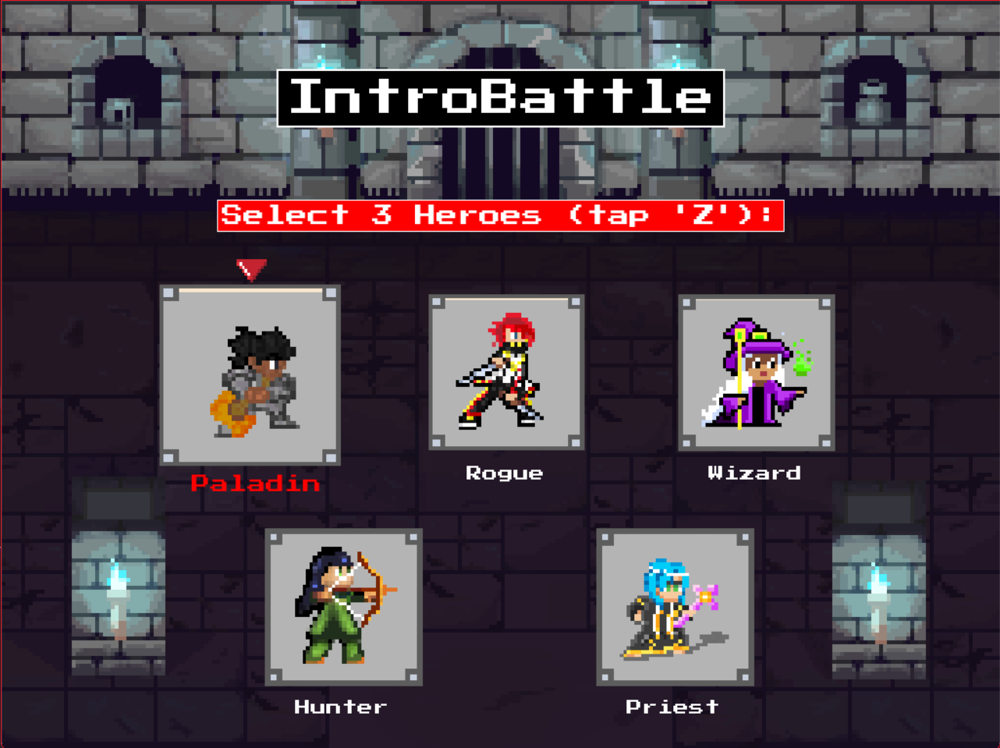
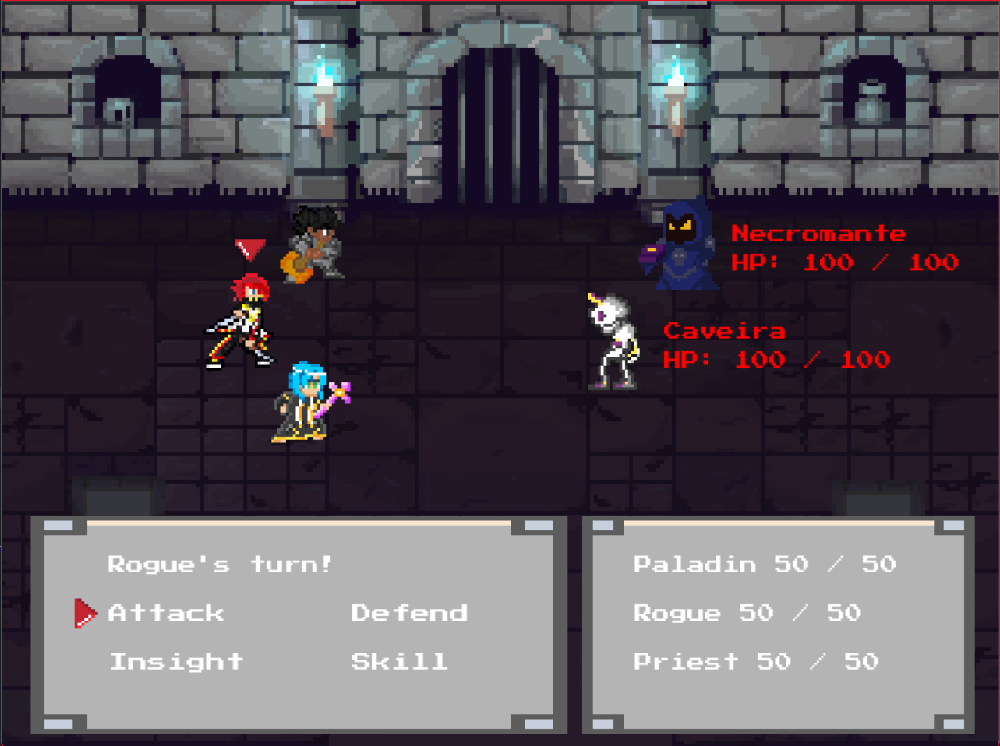
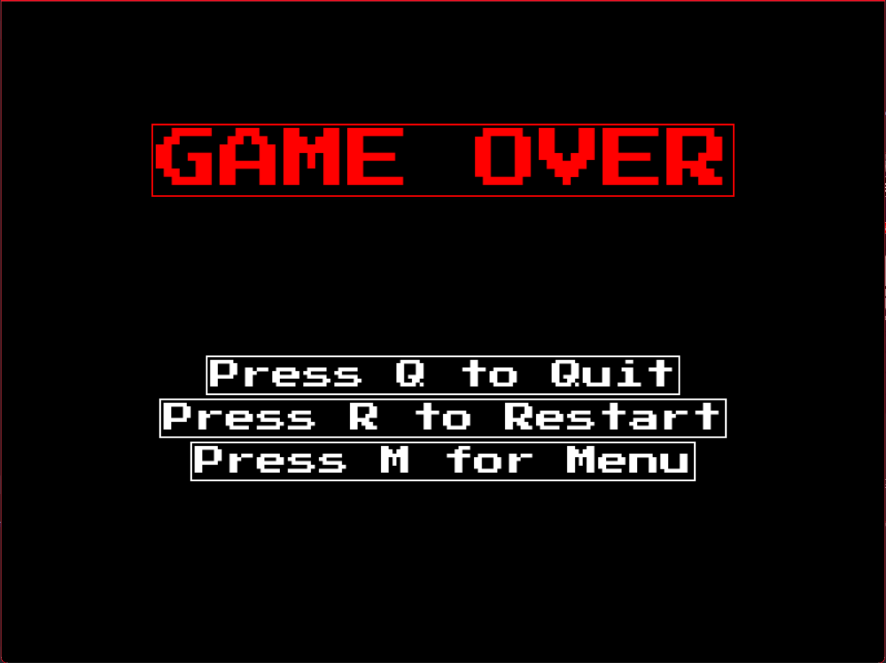

# IntroBattle - Mini RPG Game in Python

## Description

**IntroBattle** is a mini RPG game implemented in Python, featuring a character selection screen, battle mechanics, and a variety of media assets including backgrounds, effects, and character sprites. The game allows players to choose from different characters and engage in turn-based combat.

## Screenshots

### Character Selection Screen
This is the screen where you can choose your character before starting the battle:



### Battle Scene
A battle scene where characters engage in turn-based combat against enemies:



### End Game Menu
The end game screen, which appears whether you win or lose a battle:



## Installation

1. Clone the repository:
   ```bash
   git clone https://github.com/ThiagoLahass/IntroBattle--Mini-RPG-game-in-python
   cd IntroBattle--Mini-RPG-game-in-python
   ```

2. Install the required dependencies:
    ```bash
    pip install -r requirements.txt
    ```

## Usage

1. Run the game:
    ```bash
    python src/main.py
    ```

2. Follow the on-screen instructions to select a character and start the game.

## File Structure

- `media/`: Contains all media assets used in the game.

  - `Background/`: Background images for the game.
  - `Fonts/`: Font files used in the game.
  - `Personagens/`: Character sprites.
  - `Screenshots/`: Screenshots from the main parts of the game.
  - `Sons/`: Sound effects and music.
    - `Efects/`: Sound effects (e.g., game win, take damage).
    - `Musics/`: Background music tracks.
  - `UI/`: User interface elements (e.g., buttons, health bars).
  - `Weapons/`: Weapon sprites.

- `src/`: Contains the source code files for the game.

  - `character.py`: Defines the character class and related functionality.
  - `game.py`: Main game logic and mechanics.
  - `main.py`: Entry point for running the game.
  - `utils.py`: Utility functions.
  - `weapon.py`: Defines the weapon class and functionality.

- `requirements.txt`: Lists the dependencies required to run the project.
- `license`: License information for the project.
- `README.md`: This README file.

## Dependencies

- Python `3.x`
- `pygame`: For game development.
- `math`, `random`, `sys`: Standard Python libraries used in the project.

## Acknowledgments

Thank you for checking out **IntroBattle - Mini RPG Game in Python**! If you enjoyed this project or found it useful, please consider giving it a ⭐ star on GitHub. Your support is greatly appreciated!